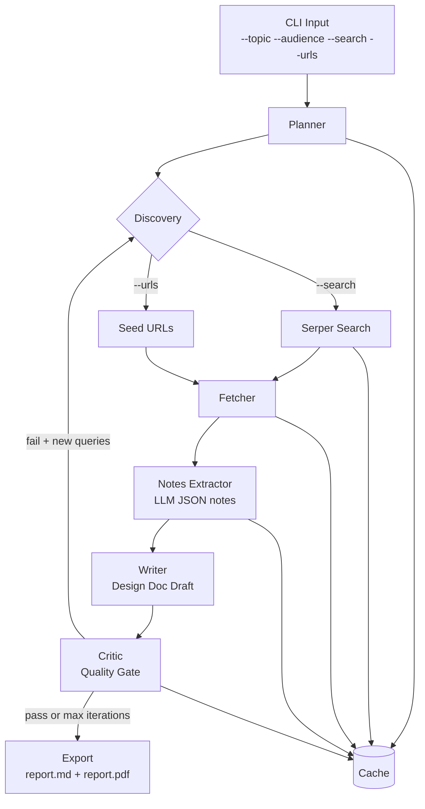

# Research + Structured Report Agent (V2)

A CLI-first research assistant that turns a topic into a **citation-grounded engineering design report** (Markdown + PDF).

It is intended for Senior/Staff-level engineers who need a fast, structured, technically rigorous write-up with explicit trade-offs, risks, and rollout guidance.

## What this app does

Given a topic (and optionally seed URLs), the agent runs a multi-stage pipeline:

1. Builds a research plan.
2. Searches the web through Serper (`--search`), and/or uses provided URLs.
3. Fetches source pages.
4. Extracts atomic technical notes in structured JSON.
5. Writes a full design document with required engineering sections.
6. Runs a critic/quality gate; can iterate with follow-up queries.
7. Exports `report.md` and `report.pdf`.
8. Caches intermediate artifacts for repeatable and faster runs.

## Architecture diagram



## Setup

```bash
cd research_agent
python3 -m venv .venv
source .venv/bin/activate
pip install -r requirements.txt
cp .env.example .env
```

Set environment variables in `.env`:

- `OPENAI_API_KEY` (required)
- `SERPER_API_KEY` (required when `--search` is used)

## CLI usage

### Typical run

```bash
python main.py \
  --topic "Agentic AI architecture for mobile apps" \
  --audience "Senior iOS developers" \
  --search \
  --max-sources 8 \
  --iterations 2 \
  --outdir outputs
```

### Useful flags

- `--topic` (required): research topic.
- `--audience`: target reader profile (default: senior software engineers).
- `--length`: `short | medium | long`.
- `--search`: enable Serper-backed web discovery.
- `--urls`: comma-separated seed URLs to include directly.
- `--max-sources`: cap discovered sources (default: 8).
- `--iterations`: critic loop passes (default: 2).
- `--model`: LLM model name (default in spec: `gpt-5`).
- `--outdir`: output directory (default: `outputs`).
- `--no-cache`: disable cache reads/writes.

## Output artifacts

After a successful run, expect:

- `outputs/report.md` — full structured design report.
- `outputs/report.pdf` — PDF export of the report.
- `outputs/cache/*` — cached planner/search/fetch/notes/review artifacts.

## Current report behavior (important)

The app still aims to generate structured engineering reports, but it does **not** currently hard-guarantee a fixed section checklist.

In particular, do **not** assume these sections will always appear automatically:

- TL;DR
- Problem
- Goals / Non-Goals
- Proposed Design
- Failure Modes & Edge Cases
- Performance & Cost
- Security & Privacy
- Testing Plan
- Rollout Plan
- Alternatives Considered
- Open Questions
- References

What is still expected:

- Output is grounded in extracted notes.
- When sources are available, technical claims should include citations `[S#]`.
- If no sources are available, the report should include `Assumptions & Limitations`.

## Quick smoke test

```bash
python main.py --topic "Test report" --search --max-sources 3 --iterations 1
```

If configured correctly, this should produce both Markdown and PDF outputs in `outputs/`.
